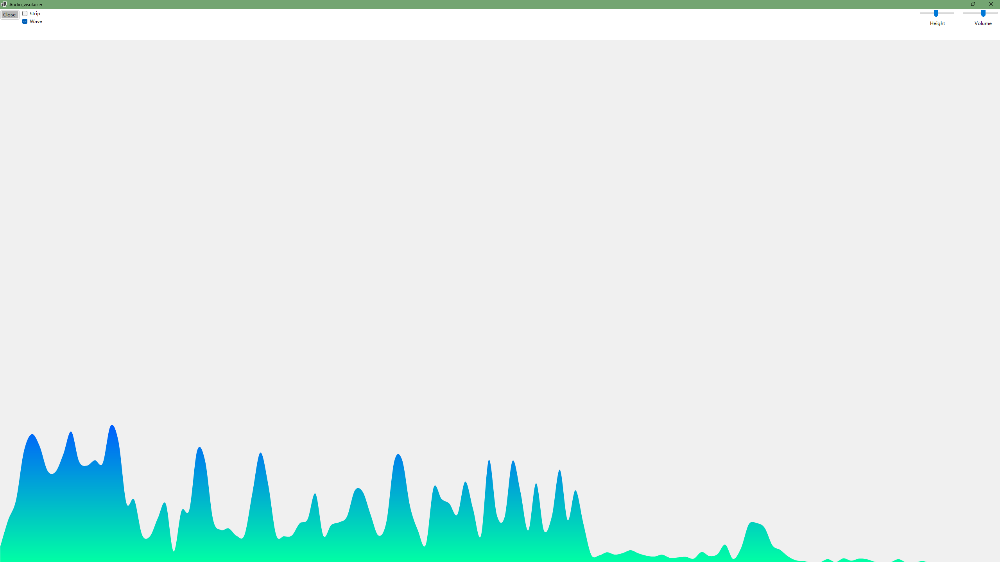

# Sound Visualization

An audio visualization player based on NAudio, FFT, and WinForms.

Features:

Audio playback (MP3 / WAV / MP4)
FFT spectrum analysis
Dynamic color gradients
Bar / Waveform visualization
Mel-scale frequency band segmentation

